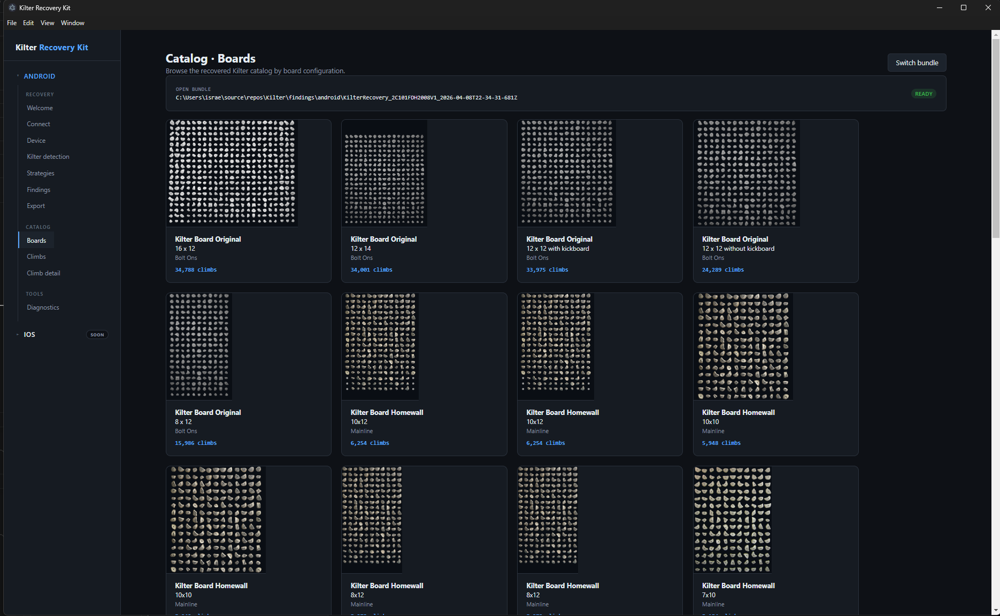
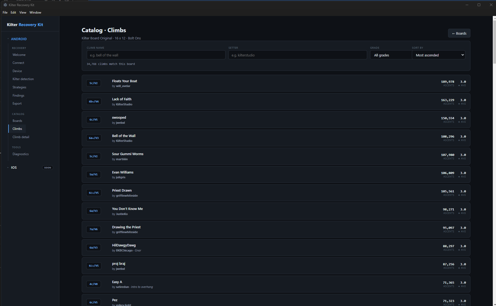
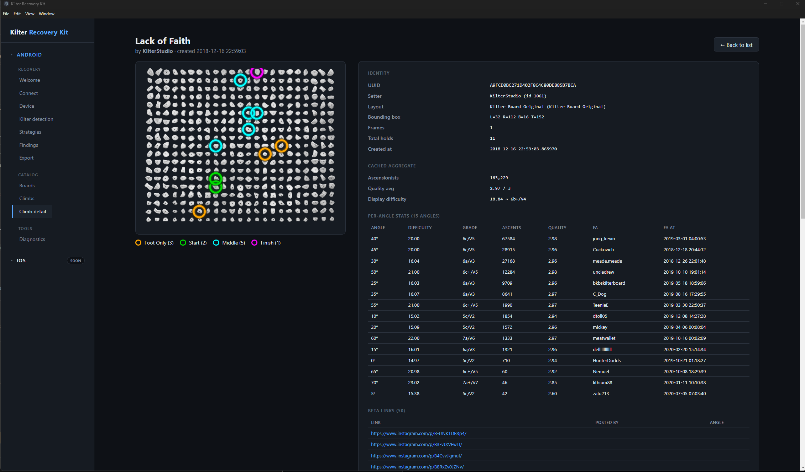
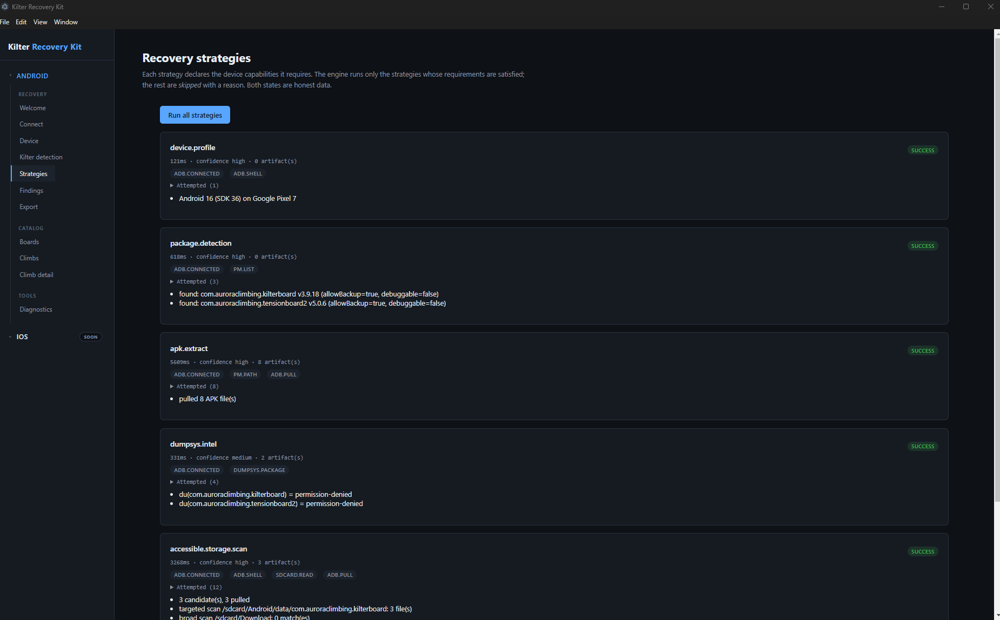
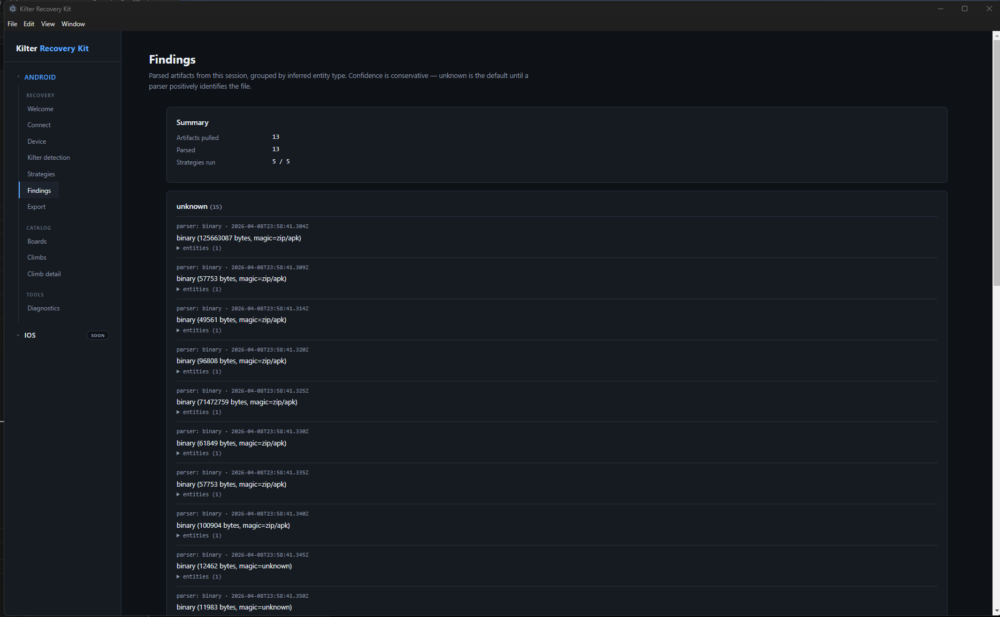

<div align="center">

# Kilter Recovery Kit

**A desktop forensic toolkit for recovering, parsing, preserving, and browsing local Kilter Board climbing-app data — straight from your own phone.**

[]() []() []() []()

[Quickstart](docs/QUICKSTART.md) · [Architecture](docs/ARCHITECTURE.md) · [Android status](docs/ANDROID_STATUS.md) · [iOS onboarding](docs/IOS_ONBOARDING.md) · [Agent guide](CLAUDE.md)

</div>

---

## Why this exists

If you've ever been a regular at a Kilter Board gym, you know the ritual: open the app, scroll through thousands of problems set by climbers around the world, find the V4 a friend just sent, watch their Instagram beta, project it for an hour, log the send.

Then one day **the app updates, the API changes, the catalog goes weird**, and the problems you cared about — the ones your friends set, the ones your gym programmed for the comp, the ones that defined your last six months of climbing — start disappearing from the feed. Or worse, you upgrade your phone, the app re-syncs, and you find yourself wondering: *was any of that ever really mine?*

The Kilter Board catalog is a **public, community-built dataset of 344,504 climbs**, lovingly authored by 50,000+ setters, with 32,000 Instagram beta videos linked across them. It lives in a SQLite database that ships embedded inside every release of the Android APK and the iOS IPA. **Every install of the app already has a copy of this entire library on disk.** It's right there, on your phone, today.

This project exists to **give you that copy back, on your terms**. To answer, with evidence and honest uncertainty:

> *What useful Kilter-related data still exists locally on this device, and how reliably can we extract it?*

It's not a replacement for the Kilter Board app. It's a forensic recovery toolkit. **Recovery is not guaranteed**. Nothing leaves your machine unless you explicitly export it. Every command we run is logged for you to see. We report what exists, what's accessible, what was parsed, and what remains impossible without stronger access — and we never lie about any of it.

## What you get

Once you've connected your Android device and run a recovery, the toolkit gives you:

### 🔍 A complete forensic snapshot of the Kilter app on your device
- The APK file(s), with full version metadata, signing certs, and manifest flags
- The `dumpsys package` text dump (install times, last update, permissions)
- Anything the app wrote to publicly accessible storage (caches, databases, JSON files)
- Real-time structured logs of every adb command, every file pulled, every parser invocation

### 📚 An in-app browser for the entire Kilter catalog
- **22 official board configurations** (Original 12×14, 16×12 Super Wide, Homewall 10×10, etc.) with the actual rendered board images extracted from the APK
- **251,298 listed climbs** across Original + Homewall, indexed by board, searchable, filterable, sortable
- **Per-climb detail view** with the holds rendered as a colored SVG overlay on the actual board image — exactly the same colors and positions the official app uses
- **Per-angle stats** for each climb: difficulty + V-grade + ascensionist count + first ascent username and date, across all 15 supported angles (5° to 70°)
- **Instagram beta links**: every video any climber has linked as their beta for any climb, with thumbnails

### 📦 A self-contained evidence bundle, ready to export
- Verbatim copies of every recovered file, named by sha256
- Normalized JSON for every parsed artifact
- Machine-readable `report.json` and human-readable `report.md`
- Structured NDJSON log of the entire session
- Drop the bundle in a folder, and the catalog browser opens it back up exactly the same — anywhere, on any machine

### 🛡️ A safe, transparent, no-root experience
- **Zero data leaves your machine** unless you click "Export"
- **No root required** for any of Phase 1
- **Sandboxed renderer**, `contextIsolation: true`, all IPC channels typed end-to-end
- Every recovery strategy declares its required capabilities up front and **gracefully reports `skipped` with a documented reason** when those capabilities aren't available — no fake successes
- Real-time **Diagnostics** screen surfaces every adb command, exit code, duration, and stderr

## Where this is going

This is **Phase 1**. The architecture is intentionally split into platform branches:

| Phase | Platform | Status |
|---|---|---|
| **Phase 1** | Android (no root) | ✅ **Complete and validated** against a real Pixel 7 / Android 16 |
| **Phase 2** | iOS (no jailbreak) | ⏳ **Open** — looking for a contributor; full [onboarding tour](docs/IOS_ONBOARDING.md) ready |
| **Phase 3** | Android (rooted "advanced mode") | 📋 Planned — would yield the user's personal logbook (`ascents`, `bids`, `circuits`, `walls`, `tags`) from `/data/data/<pkg>/databases/` |
| **Phase 4** | Open community archive | 📋 Planned — separate product, opt-in upload of normalized catalog data |

**The big-picture vision:** a desktop tool any climber can run on their own device, that turns the Kilter Board catalog from "something locked inside an app I can't trust" into "a structured, searchable, exportable archive I own and can preserve." Plus the open architecture for someone to write the iOS half, and eventually the rooted-Android extraction that recovers personal logbooks too.

**This is a project for climbers, by climbers, that treats the public Kilter catalog as a community resource worth preserving.**

## A peek inside

> *Screenshots go here once captured. Drop PNGs into [`docs/screenshots/`](docs/screenshots/) and reference them below.*

### The Boards screen — every official board configuration that has at least one climb


### The Climbs screen — searchable, filterable, sortable


### The Climb detail view — full overlay on the actual board image


### The Recovery flow — honest, evidence-based, with capability gating


### The Diagnostics screen — every adb command in real time


## Quick start

```bash
git clone https://github.com/israelvi/kilter-recovery-kit
cd kilter-recovery-kit
bun install
bun run dev
```

Full setup, prerequisites, and troubleshooting → **[docs/QUICKSTART.md](docs/QUICKSTART.md)**.

To try the catalog browser without doing a recovery, drop a Kilter Board APK in `findings/android/sample/raw/` and pick that folder in **Boards → Pick recovery bundle**. Details in **[findings/android/sample/README.md](findings/android/sample/README.md)**.

## How it works (90-second tour)

**Recovery side.** You plug in your phone, the app detects `adb`, lists devices, captures the device profile (Android version, SDK, manufacturer, build fingerprint), then probes which capabilities are actually available on this specific device (`pm.list`, `pm.path`, `dumpsys.package`, `sdcard.read`, `mediastore.query`, `root`). It runs five recovery strategies in order, each declaring its required capabilities up front and gracefully skipping when those aren't met:

1. `device.profile` — refresh the device info via `getprop`
2. `package.detection` — `pm list packages` + `dumpsys package` for known Kilter package ids and their hint variants
3. `apk.extract` — `pm path` + `adb pull` for every detected package's APK files
4. `dumpsys.intel` — capture the full `dumpsys package` text + best-effort `du -sh /data/data/<pkg>` (will be permission-denied without root, recorded honestly)
5. `accessible.storage.scan` — two-pass: targeted package-scoped scan first, then a bounded broad scan with `-maxdepth 4` over `/sdcard` looking for files that match Kilter-related name + extension heuristics

Every recovered file gets a sha256, gets routed through a parser registry (SQLite, JSON, Android shared-prefs XML, generic binary catch-all), and ends up in a `RecoverySession` with full provenance. You can export the whole thing as a self-contained bundle that includes raw artifacts, normalized JSON, a human-readable report, and a structured log of everything that happened.

**Catalog side.** Once you have a recovery bundle (or you point the app at one someone else made), the catalog browser opens it. It looks for the Kilter Board base APK inside `<bundleDir>/raw/`, extracts the **190 MB embedded SQLite database** from `assets/db.sqlite3`, extracts the 22 board renders from `assets/img/product_sizes_layouts_sets/*.png`, and **precomputes all 251k climbs into in-memory buckets** by board configuration with **real set-aware** counts (not bbox approximations — actually parses the `frames` column of each climb to determine which hold sets it requires). After the precompute runs once (~1-2 seconds), every navigation in the catalog UI is instant.

## Project anatomy

```
docs/
  QUICKSTART.md            install, run, troubleshoot
  ARCHITECTURE.md          process model, module boundaries, data flow
  ANDROID_STATUS.md        Phase 1 state — what's done, validated facts, gotchas
  FEASIBILITY.md           what's recoverable on Android, why and why not
  STRATEGY_MATRIX.md       capability matrix → strategy gating
  ROADMAP.md               phase plan
  IOS_ONBOARDING.md        tour for the iOS Phase 2 developer
  screenshots/             marketing imagery

CLAUDE.md                  Agent operating manual — read first if you're an AI

electron/                  Main process (Node, never imported by renderer)
  models/                    shared TypeScript types
  services/
    adb/                     Android Debug Bridge wrapper
    recovery/                Strategy engine + 5 strategies
    parsers/                 Pluggable artifact parser registry
    catalog/                 In-app Kilter catalog browser backend
    export/                  Evidence bundle writer
    logging/                 NDJSON logger + ring buffer

src/                       Renderer (React, sandboxed, no Node)
  screens/                   one .tsx per screen, including the catalog screens

scripts/                   Utility CLIs (sqlite inspector, climb renderer, etc.)
findings/                  GIT-IGNORED. Recovery bundles + extracted catalog data.
findings/android/sample/           NOT gitignored — drop a Kilter APK here for the demo
```

For the full layout breakdown → **[CLAUDE.md](CLAUDE.md)**.

## For contributors

**You want to extend Android?** Start with **[docs/ANDROID_STATUS.md](docs/ANDROID_STATUS.md)** — it has the full state of what's built, what's validated, and the open TODO list at the bottom. Common asks: APK parser (open the APK as a ZIP, recursively parse interesting files inside), `runas.extract` strategy (honest negative case for production builds), `mediastore.query` strategy, multi-frame climb animation in the catalog, gym presets.

**You want to build the iOS side?** Read **[docs/IOS_ONBOARDING.md](docs/IOS_ONBOARDING.md)** end-to-end. It's a guided tour that walks you through the project, the architecture, the patterns you'll be reusing, the iOS-specific landscape (libimobiledevice, encrypted backups, house_arrest), and where exactly you'll be writing code. If you're using an AI agent, just say *"I'm here to work on iOS"* and the agent will start the tour automatically.

**You're an AI agent?** Read **[CLAUDE.md](CLAUDE.md)** first. It's the operating manual: package manager conventions, native module gotchas, IPC patterns, what to never do, and the explicit triggers for the Android and iOS onboarding flows.

## Philosophy

**Honest uncertainty.** We don't promise recovery — we report what exists, what's accessible, what can be parsed, what can be preserved, and what remains impossible without stronger access. The Android side has multiple strategies that *correctly* report `skipped` or `failed` with documented reasons. That's a feature, not a bug. The user always knows exactly what was tried, what worked, and what's impossible.

**Evidence-based UX.** Every recovered datum carries provenance: source device, acquisition method, sha256 hash, parser used, extraction timestamp, confidence score. Every adb command we run is visible in real time on the Diagnostics screen. The user can audit everything.

**User-consented, local-first.** This is a tool for recovering data from **your own** device with **your explicit consent**. Nothing leaves your machine unless you click "Export". No telemetry, no cloud sync, no analytics, no background phone-home.

**Open architecture.** Strategies are pluggable. Parsers are pluggable. Adding a new platform (iOS) is a matter of writing new strategies, not rewriting the app. The catalog browser is platform-agnostic — once iOS extraction produces a recovered SQLite database, the catalog UI just works with no changes.

## Acknowledgments

This project exists because of the climbers who built the Kilter Board public catalog over the years — the **50,000+ setters** who put problems out there, the **108,296 ascensionists** who logged sends on a single popular V4, the climbers who took the time to upload their beta to Instagram so the next person could learn from them. The catalog is a shared resource and this toolkit is one small attempt to treat it that way.

Special thanks to **Aurora Climbing** for building Kilter Board, Tension Board, and the rest of the LED training board ecosystem. This toolkit is built in good faith, on data the user already legitimately installed on their own device, with the goal of empowering the climbing community to preserve and explore the catalog they helped create. If you're at Aurora Climbing and have feedback or concerns, please open an issue.

## License

TBD by repo owner. The toolkit code (everything outside `findings/`) is original work and will be MIT or Apache-2.0 licensed. Any APK or content recovered from the Kilter Board app remains the property of Aurora Climbing — this toolkit does not redistribute their content beyond the contributor's own machine, except optionally inside `findings/android/sample/raw/` if the maintainer chooses to ship a quickstart bundle.
